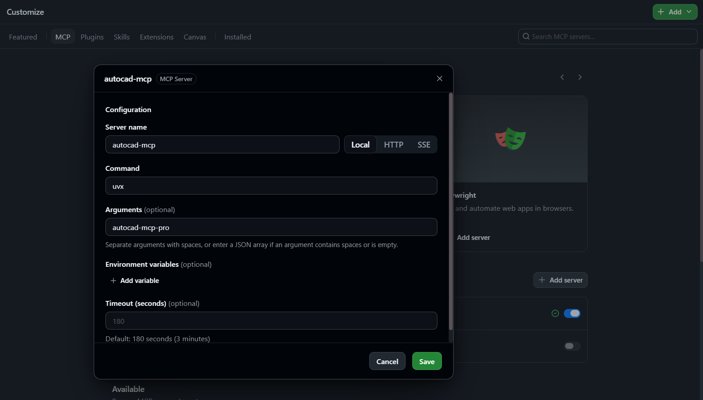
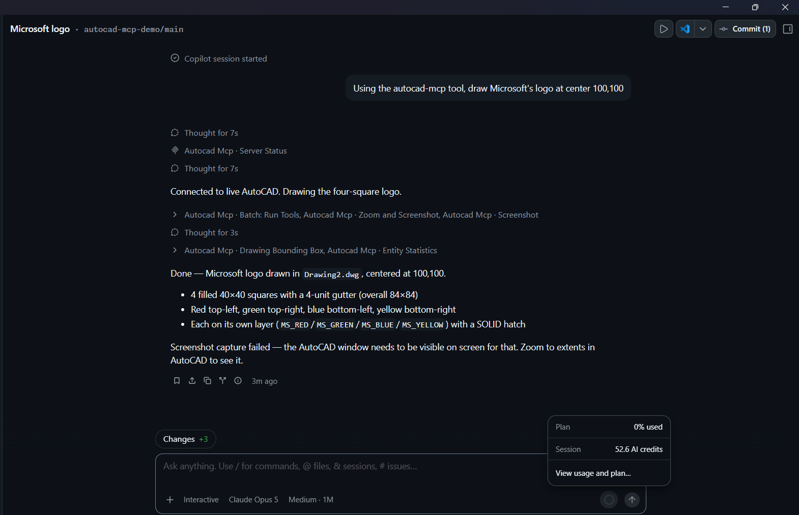
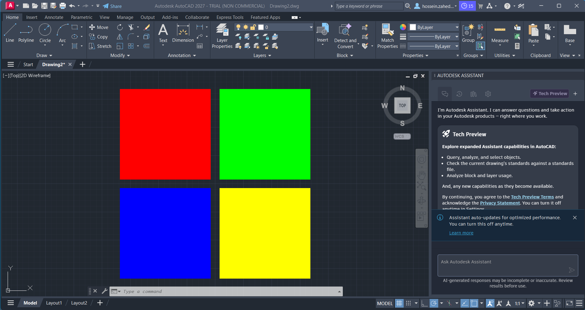
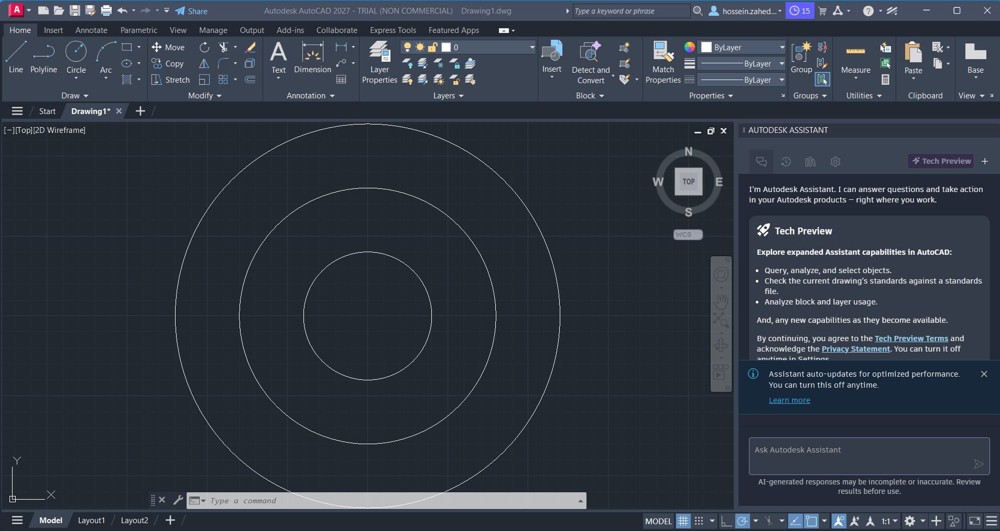
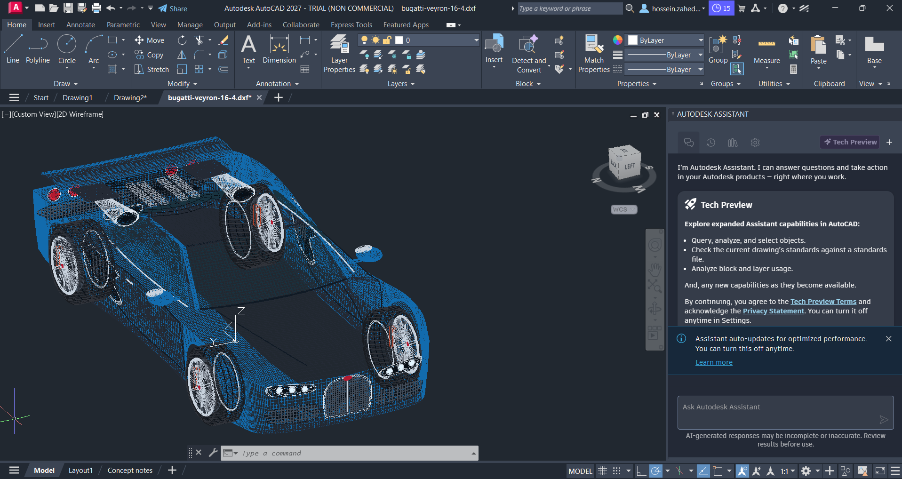

# 📐 AutoCAD MCP Demo

A demo showing how to drive AutoCAD from GitHub Copilot using the [AutoCAD MCP Pro](https://github.com/U-C4N/Autocad-MCP) MCP server. Copilot connects to a live AutoCAD session and issues drawing commands (shapes, layers, colors, etc.) through natural-language prompts.

The MCP tooling updates the **active drawing in AutoCAD live** — changes requested through Copilot appear in real time in the open AutoCAD session, with no manual import/export step.

> 🧪 Tested with **AutoCAD 2027 Trial version**.

## 🔌 MCP Server

Repository: https://github.com/U-C4N/Autocad-MCP

### 💻 GitHub CLI

```
/mcp add autocad-mcp "uvx autocad-mcp-pro"
```

### 🤖 GitHub Copilot App

| Field       | Value             |
|-------------|-------------------|
| Server name | `autocad-mcp`     |
| Command     | `uvx`             |
| Argument    | `autocad-mcp-pro` |

### 🧩 VS Code (`mcp.json`)

```json
{
  "mcpServers": {
    "autocad-mcp": {
      "command": "uvx",
      "args": ["autocad-mcp-pro"]
    }
  }
}
```

## 🖼️ Outputs

### ⚙️ MCP Config

Configuring the `autocad-mcp` server in the GitHub Copilot app.



### 💬 GitHub Copilot App Session

Prompting Copilot to draw the Microsoft logo via the `autocad-mcp` tool.



### ✅ Session Output

The resulting drawing in AutoCAD: four colored squares (red, green, blue, yellow) forming the Microsoft logo, each on its own layer.



### 🔵 Second Example

Another example generated through the same MCP session, drawing a set of concentric circles in AutoCAD.



### 🏎️ Bugatti Veyron 16.4

**Prompt:** Use the autocad-mcp to create a 3D design of a Bugatti Veyron 16.4

**Model:** GPT 5.6 Astra



